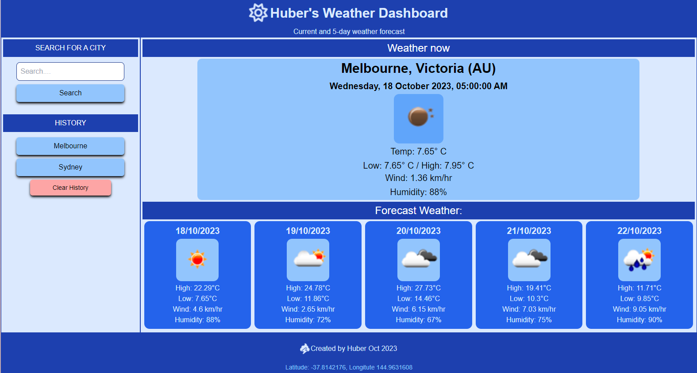

<a name="readme-top"></a>

# weather-dashboard

Challenge 6 - Server Side APIs

## Description

This webpage is a Weather Dashboard allowing the user to search for a city across the globe to view:

1. Current weather, and
2. A 5-day weather forecast 

The Weather dashboard has some other notable features
* Storage storage of search history to allow for quick searches
* Clear history button to remove previous searches
* The history section is hidden when there are no previous searches stored

This webpage was developed without a boiler plate

## User Story

```
AS A traveler
I WANT to see the weather outlook for multiple cities
SO THAT I can plan a trip accordingly
```

<p align="right">(<a href="#readme-top">back to top</a>)</p>

## User Acceptance Criteria

```
GIVEN a weather dashboard with form inputs

WHEN I search for a city
THEN I am presented with current and future conditions for that city and that city is added to the search history

WHEN I view current weather conditions for that city
THEN I am presented with the city name, the date, an icon representation of weather conditions, the temperature, the humidity, and the wind speed

WHEN I view future weather conditions for that city
THEN I am presented with a 5-day forecast that displays the date, an icon representation of weather conditions, the temperature, the wind speed, and the humidity

WHEN I click on a city in the search history
THEN I am again presented with current and future conditions for that city

```
<p align="right">(<a href="#readme-top">back to top</a>)</p>

## Screenshot

The below is a screenshot of the web application's appearance



<p align="right">(<a href="#readme-top">back to top</a>)</p>

## Installation

Cloning the repo is the only step required.

<p align="right">(<a href="#readme-top">back to top</a>)</p>


## Usage
<a name="URL"></a>
Link to deployed website is found here:
* https://hybee234.github.io/weather-dashboard/
  
index.html, script.js and style.css files can be opened in Visual Studio Code

<p align="right">(<a href="#readme-top">back to top</a>)</p>
 

## Credits
Othneildrew - for the example on linking back to the top of the readme page!

<p align="right">(<a href="#readme-top">back to top</a>)</p>

## License

Please refer to the LICENSE in the repo.
<p align="right">(<a href="#readme-top">back to top</a>)</p>

## Badges

N/A
<p align="right">(<a href="#readme-top">back to top</a>)</p>

## Features

Extensive console logging has been embeeded across the application to capture important events:
* Functions being called
* Listener evenst being triggered

Extensive effort was invested into meaningful commentary
* Within script.js and index.html

I hope this makes for easier review for anyone taking a closer look. Appreciate any feedback

<p align="right">(<a href="#readme-top">back to top</a>)</p>

## Technologies used

* HTML
* CSS
* Javascript
* Tailwind CSS Framework
* FontAwesome
* OpenWeather API
* DayJS

N/A
<p align="right">(<a href="#readme-top">back to top</a>)</p>

## Tests

### Application specific:

#### Page Load
* Validate that when the page loads that you are presented with your previous searches (from local storage) if you have any stored
* Validate that if you do not have previous searched stored, that the History section and the "clear History" button are hidden

#### Search
* Validate that when you submit a search for a city - the webpage successfully identifies a matching City and renders the weather for display
* Validate that the webpage returns a modal pop up if the city name cannot be found
* Validate that the webpage returns a modal pop up if a user attempts to click Search with an empty search field
* Validate that a successful search will add a button to the history section (and toggle the history section to be visible)

#### Weather now
* Validate that the "Weather Now" section displays displays suitable information (City, state, country match), Date and Time should not be more than 3 hours away (the server supplies forecast information every 3 hours).
* Validate that the Date/time is AEDT (i.e. should be a future date within 3 hours)
* Validate that the values a representive of now (e.g. search a local location and determine if the numbers look/feel correct)
* Validate that if the weather server does not return a "state" that the title of the section omits the state and displays only the City Name and Country Code

#### Forecast
* Validate that the forecast successfully displays up to 5 days in advance (Noting that the server only provides up to 5 days results (40 x 3 hour values))
* Validate that the dates populating on the forecast make sense (i.e. one card for each date over the next 5 days)
* Validate that 

### History
* Validate that cities being searched are populating buttons in the history section for quick searches
* Validate that clicking on the buttons triggers an update on the dashboard to display information relevant to the city chosen
* Validate that the history buttons persist even after closing the browser and returning to the website
* Validate that clicking on the "clear history" button clears all history buttons

#### Responsive Design
* Validate that the webpage has a responsive design and scales for different screensizes

* Validate that the correct date displays when the page loads
* Validate that you are presented with 9 slots where tasks can be captured (9am - 5pm) - each slot representing an hour of the working dya
* Validate that, compared to the current time, slots in the past are grey, the current hour is red and future hours are green
* Validate that you are able to type into the main field in each hourly slot (i.e. enter a task)
* Validate that when you save the task for the hour, that the task remains when you refresh the page

### Developer practice tests:
* Validate that the application deployed at the live URL (<a href="#URL">Navigate to URL</a>)
* Validate that the webpage loaded without errors
* Validate that GitHub URL has been submitted
* Validate that GitHub repository contains application code
* Validate that the application resembles mock-up provided in the challenge instructions
* Validate that the GitHub repository has a unique name
* Validate that the GitHub repostiory followed be practice for class/id naming conventions, indentation, quality comments, etc
* Validate that the repository contains multiple descriptive commit messages
* Validate that the repository contains a quality README file with description, screenshot and link to deployed applications

<p align="right">(<a href="#readme-top">back to top</a>)</p>

